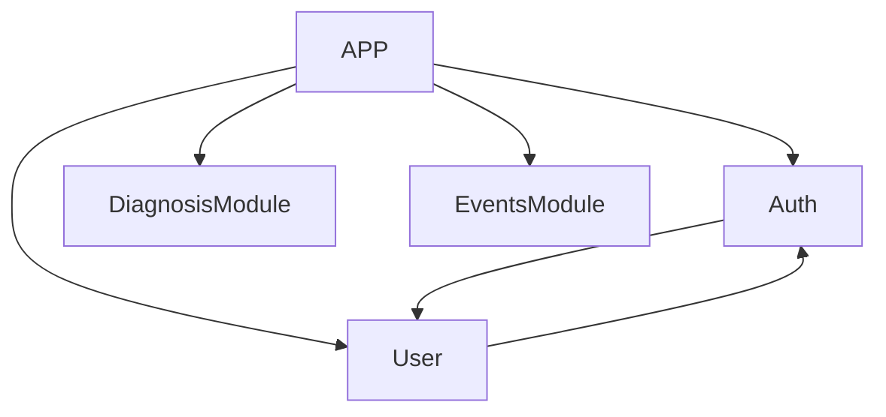

# [ With Pet ] 딥러닝 기반 반려동물 안구 보조 진단 서비스 앱 (Deep learning-based pet eye-assisted diagnostic service application)

호서대 컴퓨터공학과 졸업프로젝트입니다.

참여인원: 팀장\_김민수, 민정기, 이상훈, 장원일

기획, 개발, 배포한 총 기간은 2023.03.01 ~ 08.25 입니다.

This is graduate project of Hoseo university. 

Participants: Leader: Minsu Kim, Member: Jungki Min, Sanghun Lee, Wonil Jang.

Total period: 23.03.01 ~ 23.08.25

## 개발 담당 파트 (Development part)

프론트 개발 담당: 김민수, 민정기, 이상훈
서버 개발 담당: 김민수, 장원일
모델 개발: 김민수, 민정기, 장원일

Front End : Minsu Kim, Jungki Min, Sanghun Lee.
Back End: Minsu Kim, Wonil Jang.
AI Model: Minsu Kim, Jungki Min, Wonil Jang.

## 개발 일정 (Time period)

 

# ⚙️ 개발 환경 (IDE)

### 에디터(Editor)

- Visual Studio Code
- Mysql Workbench
- JupyterNoteBook

### 앱 디자인 (Application Design)

- 앱 흐름도 (Flow Chart)
  

- 앱 구현 화면 
  

# 🔨 Tech Skills

## 🖥 백엔드(BackEnd)

### 언어 / 프레임워크 (Language, Framework)

- TypeScript
- NestJs
- Python
- Django

### 데이터베이스 (Database)

- Mysql (TypeORM)

### 인프라 (Infrastructure)

- AWS Light Sail (Container, DataBase)
- AWS Route53
- Ngrok

### Module Structure

 

## 💻 프론트엔드(FrontEnd)

### 언어 / 프레임 워크 (Language, FrameWork)

- JavaScript
- React Native (Expo)

# 🧱 시스템 구조도 (System Diagram)

# ✏️ ERD

 

# 🤖 딥러닝 모델 (DeepLearning Model)

## 학습 데이터 출처

[AI HUB 반려동물 안구 질환 데이터](https://www.aihub.or.kr/aihubdata/data/view.do?currMenu=&topMenu=&aihubDataSe=realm&dataSetSn=562)

## 모델 설계 (How to build model)

CNN 구조를 바탕으로 모델 설계

학습 DataSet 은 141,452장의 이미지를 train DataSet 35,363장의 이미지를 검증 DataSet 22,058장의 이미지는 test DataSet으로 구성

- [안구 진단 딥러닝 모델 테스트 & 설계 과정 ](https://github.com/Pushedsu/Pet-Eye-Diagnosis-Model)
- [안구 진단 테스트 모델](https://github.com/pek110/pet-diagnosis)

We build model by using CNN.

A dataSet which train the model compose 141,452 images and other dataSet which check the model compose 22,059 images.
- [Ocular Diagnostic Deep Learning Model Test & Design Process](https://github.com/Pushedsu/Pet-Eye-Diagnosis-Model)
- [Ocular Diagnostic Test Model](https://github.com/pek110/pet-diagnosis)
   

# 🚫 개선 및 구현이 필요한 문제들(Problems requiring improvement and implementation)

## 채팅 서비스 미구현(Chat service not implemented)

백엔드에서는 채팅 기능을 구현하였으나 채팅 프론트 개발을 완성하지 않았고 서버에서 구현이 잘 되는지 테스트 또한 해보지 않았습니다.

채팅 서비스를 따로 더 학습하여 테스트 코드와 함께 구현해볼 예정입니다.

## 테스크 코드 부재

테스트 코드의 부재로 인해 구현한 기능들이 오류가 날 경우 이를 수정하고 다시 테스트 하는 과정이 매우 길었습니다.

이로인해 테스트 코드의 중요성을 알게 되었고 만약 시간이 된다면 추후에 유닛 테스트 코드 작성하는 방식에 대해 학습 후 구현할 예정입니다.

# ❕ 느낀점

## 아쉬운 점

### UI 미설계

피그마를 통해 UI를 사전에 설계를 했으면 프론트 UI 개발 시에 구현 기간이 줄어들었을 것으로 예상되어 아쉬웠습니다.

### 모델 학습에 필요한 컴퓨터 사양 부족

대략 19만장 정도의 반려견 안구 이미지를 가져와 학습을 시켰는데 보통 1epoch당 1시간 정도 걸려 10epoch을

실행할 때 10~11시간 정도 소요되어 여러 케이스를 테스트 할때 수일이 걸려 기한 내에 좋은 모델을 찾기 어려웠습니다.

또한 컴퓨터 성능에 따른 배치 사이즈 제한과 같은 문제점들도 있어 아쉬웠습니다.
